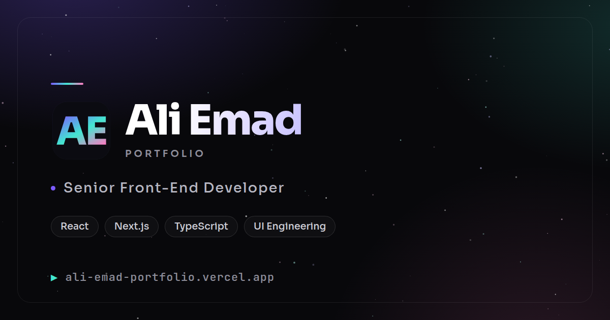

<div align="center">



<br />
<br />

# Ali Emad — Portfolio

**A modern, animated, bilingual developer portfolio.**<br />
Next.js 16 · React 19 · Tailwind v4 · English + Arabic with true RTL.

<br />

[](https://ali-emad-portfolio.vercel.app)
[](https://github.com/AliEmad0/portfolio/actions/workflows/ci.yml)
[](#-performance--seo)

<br />


### [**Visit the site →**](https://ali-emad-portfolio.vercel.app)

</div>

---

## ✨ Highlights

- **🌌 Interactive galaxy starfield** — a canvas field where stars drift on gently curving random headings and wrap at the edges, so it never settles. Scatters under the cursor, static under `prefers-reduced-motion`, and still scores 100 for performance.
- **🌍 Genuinely bilingual** — English and Arabic with real RTL. Logical properties throughout, and the hero splits Latin per character but Arabic **per word**, because Arabic is cursive and per-character spans sever the letter joins.
- **⌨️ An IDE for a blog** — posts are `.mdx` files browsed through a file explorer, tab strip and editor pane. Frontmatter is zod-validated, so a malformed post fails the build instead of shipping broken.
- **✦ A brand, not a template** — an AE monogram cut from Sora outlines, driving the favicon, the social cards and the footer lockup.
- **📬 Working contact form** — a zod-validated API route with honeypot spam protection, delivering through Resend.
- **♿ Accessibility 100, SEO 100** — plus 99 performance and 100 best practices, measured with Lighthouse against the live site.

<div align="center">

**[Home](https://ali-emad-portfolio.vercel.app/en)** · **[Blog](https://ali-emad-portfolio.vercel.app/en/blog)** · **[العربية](https://ali-emad-portfolio.vercel.app/ar)** · **[RSS](https://ali-emad-portfolio.vercel.app/en/rss.xml)**

</div>

---

## 🧱 Tech stack

| Layer     | Choice                                                                      |
| --------- | --------------------------------------------------------------------------- |
| Framework | **Next.js 16** (App Router, RSC-first) · **React 19**                       |
| Language  | **TypeScript** (strict)                                                     |
| Styling   | **Tailwind CSS v4** (CSS-first `@theme`, dark galaxy palette)               |
| i18n      | **next-intl** — `/en` + `/ar`, full RTL                                     |
| Motion    | **GSAP** + ScrollTrigger (`useGSAP`) · **Motion** · **Lenis** smooth scroll |
| Content   | **zod**-validated JSON + **MDX** (`next-mdx-remote`, `rehype-pretty-code`)  |
| Email     | **Resend** REST API                                                         |
| Testing   | **Vitest** + Testing Library (43 tests)                                     |
| Analytics | **Vercel Web Analytics**                                                    |
| Hosting   | **Vercel** (auto-deploys from `main`)                                       |

---

## 🚀 Getting started

```bash
pnpm install
pnpm dev          # http://localhost:3000 → redirects to /en
```

> [!NOTE]
> Turbopack's dev server **doesn't run middleware**, so `/` won't redirect in dev.
> Verify routing and i18n against a production build: `pnpm build && pnpm start`.

### Environment

Copy `.env.example` to `.env.local`:

| Variable               | Purpose                                            | Required                                    |
| ---------------------- | -------------------------------------------------- | ------------------------------------------- |
| `NEXT_PUBLIC_SITE_URL` | Canonical origin for metadata, OG, sitemap and RSS | Optional (falls back to the production URL) |
| `RESEND_API_KEY`       | Contact-form delivery                              | Only for the contact form                   |
| `CONTACT_TO_EMAIL`     | Inbox that receives messages                       | Only for the contact form                   |

---

## 📜 Scripts

| Command           | Purpose                             |
| ----------------- | ----------------------------------- |
| `pnpm dev`        | Dev server (Turbopack)              |
| `pnpm build`      | Production build (also type-checks) |
| `pnpm start`      | Serve the production build          |
| `pnpm type-check` | `tsc --noEmit`                      |
| `pnpm lint`       | ESLint                              |
| `pnpm test`       | Vitest, single pass                 |
| `pnpm format`     | Prettier write                      |

---

## 🗂 Structure

```
├─ content/
│  ├─ portfolio.json          # profile, socials, skills, projects, timeline
│  └─ blog/<locale>/*.mdx     # blog posts
├─ messages/{en,ar}.json      # UI strings (nav, buttons, form labels)
├─ public/                    # og.png, resume.pdf, project shots
├─ src/
│  ├─ app/[locale]/           # routes — home, blog, rss.xml, api/contact
│  ├─ animation/              # Starfield, Lenis, GSAP wrappers, custom cursor
│  ├─ components/             # brand · layout · sections · blog · forms
│  ├─ lib/                    # content + blog loaders, zod schemas, site URL
│  └─ styles/globals.css      # theme tokens + component styles
└─ tests/unit/
```

---

## ✍️ Content

Everything is version-controlled — no CMS, no database.

**Portfolio** — `content/portfolio.json`. Localizable prose is `{ "en": "…", "ar": "…" }`, validated against a zod schema (`src/lib/schema.ts`) at import time, so malformed content fails the build and the tests.

**Blog** — drop an `.mdx` file into `content/blog/<locale>/`:

```mdx
---
title: 'A starfield that never settles'
description: '260 stars on curving random headings…'
date: '2026-07-15'
tags: ['canvas', 'animation']
---

Your post, in MDX.
```

Reading time is computed at build. `draft: true` hides a post outside development.

---

## 🌍 i18n & RTL

`localePrefix: 'always'` with `localeDetection: false` — `/` deterministically redirects to `/en`, and Arabic lives at `/ar`. The `[locale]` layout sets `<html lang dir>`.

Layout mirrors via logical properties (`inset-inline-start`, `padding-inline-end`, `ps/pe/ms/me`) rather than `[dir='rtl']` overrides. Numbers, code blocks and email addresses stay LTR islands inside RTL prose.

---

## 🎬 Motion

Every animation is **reduced-motion safe** — a global media query neutralises them, and JS-driven effects check `prefers-reduced-motion` before running.

- GSAP + ScrollTrigger for orchestrated entrances (leak-free via `useGSAP` scopes)
- Lenis for smooth scroll — note it emits no native `scroll` events, so scroll-linked state is polled via rAF
- View Transitions for the locale crossfade
- Canvas starfield, magnetic CTA, custom cursor, border-beam project cards

---

## 🔍 Performance & SEO

Lighthouse against the **live site** (desktop): **Performance 99 · Accessibility 100 · Best Practices 100 · SEO 100**.

- Per-page metadata with `metadataBase`, canonicals and `hreflang` alternates
- A static OG card for the site, plus generated per-post cards for the blog
- JSON-LD `BlogPosting` on posts · `robots.txt` · `sitemap.xml` · per-locale RSS
- Skip link, labelled controls, AA contrast, visible focus states

---

## 🚢 Deployment

Hosted on **Vercel**, auto-deploying from `main`. Work ships as PRs — CI runs type-check, lint, tests and build on every one, and the Vercel preview deploy gates the merge.

---

<div align="center">

© 2026 **Ali Emad** — all rights reserved.<br />
<sub>The code is public to read; the content, writing and brand are not for reuse.</sub>

**[ali-emad-portfolio.vercel.app](https://ali-emad-portfolio.vercel.app)**

</div>
